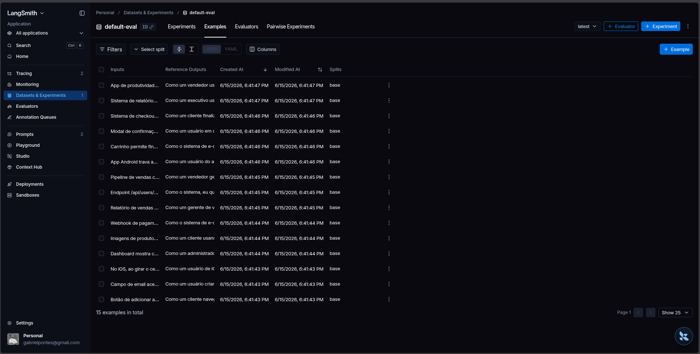
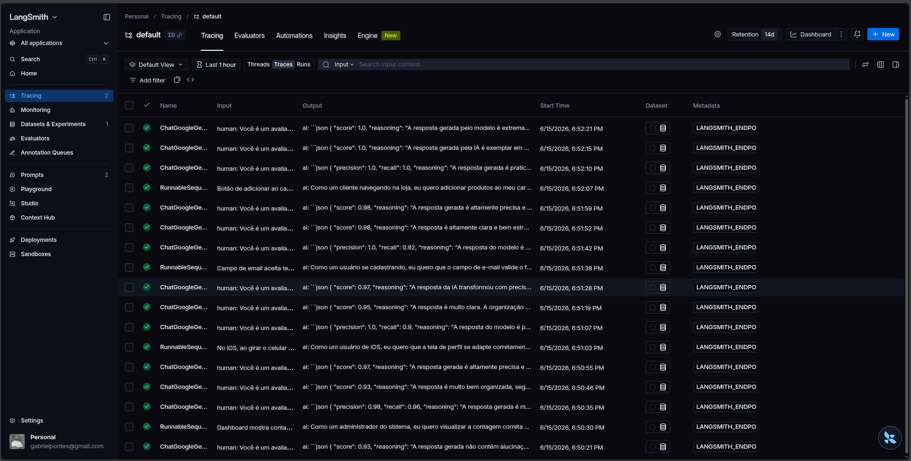
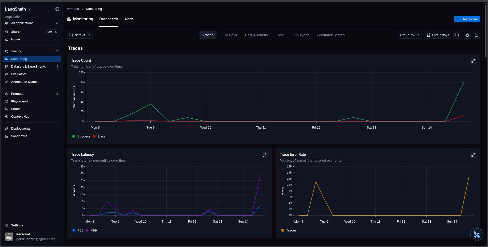

# MBA IA - Pull Evaluation Prompt

## Técnicas Aplicadas (Fase 2)

### Técnicas Escolhidas

#### 1. Persona Especializada

Foi definida uma persona especializada em análise de bugs e engenharia de requisitos para aumentar a qualidade das user stories geradas.

**Justificativa**
- Reduz ambiguidades.
- Melhora a consistência da saída.
- Aproxima o resultado do padrão utilizado por equipes ágeis.

**Aplicação**
O prompt passou a instruir o modelo a atuar como analista de requisitos responsável por converter relatos de bugs em user stories estruturadas.

---

#### 2. Context Enrichment

Foram adicionadas instruções detalhadas sobre o objetivo da tarefa, estrutura esperada da resposta e critérios de qualidade.

**Justificativa**
- Melhora a compreensão do contexto.
- Aumenta a precisão das informações extraídas.
- Reduz respostas genéricas.

**Aplicação**
O prompt passou a especificar claramente quais elementos deveriam ser identificados no relato do bug e como deveriam ser organizados na resposta.

---

#### 3. Few-Shot Learning

Foram adicionados exemplos de entrada e saída para demonstrar o padrão esperado.

**Justificativa**
- Ensina o formato desejado.
- Melhora a consistência das respostas.
- Reduz variações indesejadas.

**Aplicação**
Foram incluídos exemplos de relatos de bugs convertidos em user stories completas seguindo o formato estabelecido.

---

#### 4. Chain of Thought (CoT)

O modelo foi orientado a realizar uma análise estruturada antes de gerar a user story.

**Justificativa**
- Melhora tarefas que exigem interpretação.
- Aumenta a capacidade de identificar causa, impacto e comportamento esperado.
- Produz requisitos mais completos.

**Aplicação**
O prompt orienta a identificar problema, contexto, comportamento atual e resultado esperado antes da construção da user story.

---

#### 5. Output Formatting

Foi definido um formato de saída padronizado.

**Justificativa**
- Facilita validação automática.
- Garante consistência entre execuções.
- Simplifica consumo por equipes de desenvolvimento.

**Aplicação**
A resposta passou a seguir uma estrutura fixa contendo user story e critérios de aceitação.

---

## Resultados Finais

### Dashboard LangSmith

Dashboard público:

https://smith.langchain.com/o/7241c568-b211-4acc-aec3-2c13695e4876/dashboards/projects/2f501b30-ac1c-4f8f-a40e-9a855c2339da

---

### Resultados das Avaliações

| Métrica | Resultado |
|----------|----------|
| Helpfulness | 0.95 |
| Correctness | 0.88 |
| F1-Score | 0.81 |
| Clarity | 0.94 |
| Precision | 0.96 |
| Média Geral | 0.91 |

**Status:** APROVADO

Todas as métricas atingiram nota mínima igual ou superior a 0.80.

---

### Resultado por Exemplo

| Exemplo | F1 | Clarity | Precision |
|----------|----------|----------|----------|
| 1 | 0.55 | 0.83 | 0.90 |
| 2 | 0.75 | 0.83 | 0.93 |
| 3 | 0.70 | 0.93 | 0.97 |
| 4 | 0.73 | 1.00 | 0.93 |
| 5 | 0.32 | 0.98 | 0.97 |
| 6 | 0.89 | 0.89 | 0.97 |
| 7 | 0.89 | 0.98 | 1.00 |
| 8 | 0.91 | 0.90 | 0.97 |
| 9 | 0.81 | 1.00 | 0.93 |
| 10 | 0.84 | 1.00 | 0.92 |
| 11 | 0.92 | 0.98 | 0.93 |
| 12 | 0.97 | 0.93 | 0.97 |
| 13 | 0.95 | 0.95 | 0.97 |
| 14 | 0.96 | 0.98 | 0.98 |
| 15 | 1.00 | 1.00 | 1.00 |

---

### Comparação entre Prompts

| Aspecto | Prompt V1 | Prompt V2 |
|----------|----------|----------|
| Persona | Não possui | Analista especializado |
| Contexto | Mínimo | Detalhado |
| Estrutura da saída | Livre | Padronizada |
| Few-Shot Learning | Não | Sim |
| Chain of Thought | Não | Sim |
| Critérios de Aceitação | Não definido | Definido |
| Clareza das instruções | Baixa | Alta |
| Consistência | Média | Alta |

#### Prompt V1

```text
Você é um assistente que ajuda a transformar relatos de bugs de usuários em tarefas para desenvolvedores.

Analise o relato de bug abaixo e crie uma user story a partir dele.

Relato de Bug:
{bug_report}

User Story gerada:
```

#### Melhorias Aplicadas no Prompt V2

- Inclusão de persona especializada.
- Inclusão de contexto detalhado.
- Estrutura de saída padronizada.
- Uso de Few-Shot Learning.
- Uso de Chain of Thought.
- Inclusão de critérios de aceitação.
- Definição explícita do formato esperado.

---

## Evidências no LangSmith

### Dataset de Avaliação

- Dataset contendo 15 exemplos de avaliação.
- Utilizado sem alterações durante o processo de otimização.



### Execuções Avaliadas

Prompt avaliado:

**gabrielmpo/bug_to_user_story_v2**

Resultado final:

| Métrica | Nota |
|----------|----------|
| Helpfulness | 0.95 |
| Correctness | 0.88 |
| F1-Score | 0.81 |
| Clarity | 0.94 |
| Precision | 0.96 |

---

### Tracing

Execuções públicas:

1. https://smith.langchain.com/public/5f812847-63a8-4d2d-bf81-ca0a51512a19/r

2. https://smith.langchain.com/public/5537fd8b-2967-4ab0-ba7e-f8affc0798c0/r

3. https://smith.langchain.com/public/c7413229-cfab-4114-9578-d93efd5f2036/r

Os traces demonstram o fluxo completo de execução do prompt otimizado e foram utilizados para validação e depuração durante o processo iterativo.



---

### Dashboard

Dashboard com os gráficos das avaliações



---


## Como Executar

### Pré-requisitos

- Python 3.10 ou superior
- pip
- Ambiente virtual Python

---

### Instalação

Criar o ambiente virtual:

```bash
python3 -m venv venv
```

Ativar o ambiente virtual:

**Linux/Mac**

```bash
source venv/bin/activate
```

**Windows**

```bash
venv\Scripts\activate
```

Instalar dependências:

```bash
pip install -r requirements.txt
```

---

### Executar Testes

```bash
python tests/test_prompts.py
```

---

### Publicar o Prompt no LangSmith

```bash
python src/push_prompts.py
```

---

### Executar Avaliação

```bash
python src/evaluate.py
```
